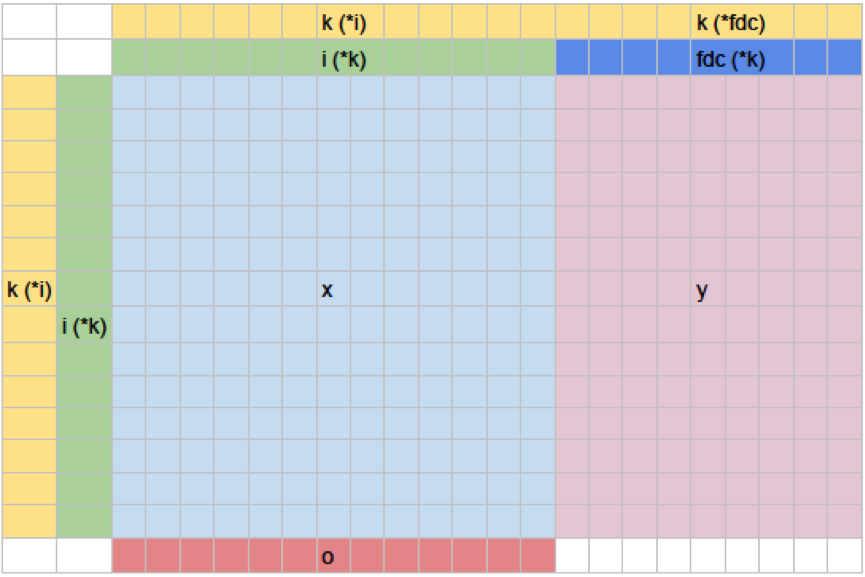

Abstract
========

The R package **decompr** implements algorithms for the analysis of
Global Value Chains. Two methods for gross export flow decomposition
using Inter-Country Input-Output tables are provided. The first method
is the **Wang-Wei-Zhu** (2014) algorithm which splits bilateral gross
exports into 16 value added components. These components can broadly be
divided into domestic and foreign value added. The second method
concerns a **source decomposition** algorithm. This derives the value
added origin of a country-industry???s exports by source country and
source industry, by applying the basic Leontief insight to gross trade
data. This article summarises the methodology of the algorithms and
describes the format of the input and output data.

Introduction
============

Global Value Chains (GVCs) have become a central factor in trade and
development policy. Policy makers from different countries and
institutions have placed them at the center of their agenda and
continuously emphasize their growing importance for both international
trade and economic development. However, analysing this phenomenon
empirically requires complex matrix manipulations, since the relevant
data is only available in the form of gross flows. This package enables
researchers with little background in matrix algebra and linear
programming to easily derive standard GVC indicators for statistical
analysis.

As mentioned above, **decompr** uses Inter-Country Input-Output tables,
such as those published by the OECD, WIOD, or national statistics
bureaus. These tables state input-output relationships in gross terms
between industries within and across countries.

For instance, let us look at the example of the leather used in German
manufactured car seats. The ICIOs quantify the value of inputs that the
Turkish leather and textiles industry supplies to the German transport
equipment industry.

The problem of these gross trade flows, is that they do not reveal how
much of the value was added in the supplying industry, and how much of
the value was added in previous stages of production, performed by other
industries or even countries.

The source decomposition of gross trade flows solves this problem, by
reallocating the value of intermediate goods used by industries to the
original producers. In our example, the use of Argentinian agricultural
produce (raw hides) is subtracted from the Turkish leather industry and
added to the Argintinian agricultural industry.

The Wang-Wei-Zhu (henceforth WWZ) decomposition goes a step further by
not only revealing the source of the value added, but also breaking down
exports into different categories, based on its usage and final
destination.

-   domestic value added in exports
-   foreign value added in exports
-   pure double counted terms

The decompr package implements the algorithms for these decompositions
as R procedures.

The next section introduces the data as it is used by the package, as
well as an example data set provided by the WIOD. Section three
summarises the theoretical derivation for the decompositions, and shows
how these can be performed in R using the package. After which we
conclude with a discussion of potential uses and limitations of this
approach.

Data
====

A sample data set of Input-Output tables is included. In order to save
space and speed up computations, the included data set uses regional
aggregates, instead of countries.

Load the included data set of WIOD regional Input-Output tables.

    data(leather)

A key step in loading the data is making sure that the dimensions of the
data inputs are correct, in the sample data we have **G = 7** (generally
countries, here regions) and **N = 34** (number of industries).

    length(countries )  # G

    ## [1] 3

    length(industries ) # N

    ## [1] 3

    dim(   inter )      # (G*N) x G*N

    ## [1] 9 9

    dim(   final )      # (G*N + totals) x G*5

    ## [1] 9 3

    length(out )        # G*N

    ## [1] 9

Methods
=======

-   Small derivation

The first step is to load the data and create the elements, there are
all stored in a list (of class **decompr**).

    elements <- load_tables_vectors( x = inter,
                                     y = final,
                                     k = countries,
                                     i = industries,
                                     o = out         )

Leontief decomposition
----------------------

-   Small derivation
-   R demonstration using WIOD data

We can now decompose the elements using the Source decomposition.

    lt <- leontief( elements )

In addition, a wrapper function called **decomp** is provided which
performs both steps at once. Though it is recomended that the atomic
functions be used for large data sets.

    lt2 <- decomp( x = inter,
                   y = final,
                   k = countries,
                   i = industries,
                   o = out,
                   method = "leontief" )

The output data is as follows

    dim(lt)

    ## [1] 9 9

    dim(lt2)

    ## [1] 9 9

Wang Wei Zhu decomposition
--------------------------

We can now decompose the elements using the Wang-Wei-Zhu (or source)
decomposition.

    w <- wwz( elements )

In addition, a wrapper function called **decomp** is provided which
performs both steps at once. Though it is recomended that the seperate
functions be used for large data sets.

    w2 <- decomp( x = inter,
                  y = final,
                  k = countries,
                  i = industries,
                  o = out,
                  method = "wwz" )

Note that **wwz** is the default method.

The output data is as follows

    str(w)

    ##  num [1:36, 1:25] 0 5.47 7.54 13.01 0 ...
    ##  - attr(*, "dimnames")=List of 2
    ##   ..$ : chr [1:36] "Argentina.Agriculture.Argentina" "Argentina.Agriculture.Turkey" "Argentina.Agriculture.Germany" "sub.TOTAL" ...
    ##   ..$ : chr [1:25] "DVA_FIN" "DVA_INT" "DVA_INTrexI1" "DVA_INTrexF" ...

Discussion
==========

Acknowledgements
================

FNS Fei Wang

References
==========

Wang, Zhi, Shang-Jin Wei, and Kunfu Zhu. 2014. “Quantifying
International Production Sharing at the Bilateral and Sector Levels.”
National Bureau of Economic Research.
